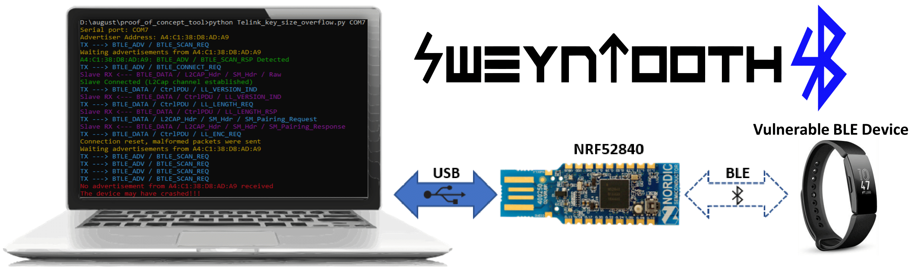

## SweynTooth - Unleashing Mayhem over Bluetooth Low Energy
**This repository is part of a research outcome from the [ASSET Research Group](https://asset-group.github.io/disclosures/sweyntooth/).**


SweynTooth captures a family of **12 vulnerabilities** (more under non-disclosure) across different Bluetooth Low Energy (BLE) software development kits (SDKs) of six major system-on-a-chip (SoC) vendors. The vulnerabilities expose flaws in specific BLE SoC implementations that allow an attacker in radio range to trigger **deadlocks, crashes** and **buffer overflows** or **completely bypass** **security** depending on the circumstances. **(Update) We have also included a testing script to check devices against the BLE KNOB variant**.

You can check more information about the vulnerabilities, **available patches** and affected devices on [ASSET Research Group SweynTooth disclosure website](https://asset-group.github.io/disclosures/sweyntooth/).

**Fitbit, August Smart Lock, Eve Energy, CubiTag** and other "Smart" things are affected.

* Fitbit Inspire Crash & CubiTag deadlock - https://www.youtube.com/watch?v=Iw8sIBLWE_w
* Eve Energy & August Smart Lock crash - https://www.youtube.com/watch?v=rge1XeJVpag&t=6s


#### Libraries included in this PoC

This PoC uses well maintained libraries such as [Scapy](https://github.com/secdev/scapy) and [Colorama](https://github.com/tartley/colorama). The BLE packet crafting and dissection is done via customized Scapy protocol layers ([bluetooth4LE](https://github.com/Matheus-Garbelini/sweyntooth_bluetooth_low_energy_attacks/blob/master/libs/scapy/layers/bluetooth4LE.py) and [bluetooth.py](https://github.com/Matheus-Garbelini/sweyntooth_bluetooth_low_energy_attacks/blob/master/libs/scapy/layers/bluetooth.py)). There's a [merge in progress](https://github.com/secdev/scapy/pull/2215) to include our additions in Scapy's main repository. 


### Getting Started (Installation)

First, you must make sure to have a **Python2.7** on your system. Secondly, SweynTooth uses the [Nordic nRF52840 Dongle](https://www.nordicsemi.com/?sc_itemid={CDCCA013-FE4C-4655-B20C-1557AB6568C9}) to send/receive raw link layer packets to and from the vulnerable peripheral over the air. It is necessary to flash the driver firmware to the board before starting the Python 2.7 scripts.

The binary of our firmware code is on the `nRF52_driver_firmware.zip` file. You need to install nrfutil tool to flash the firmware on the board. Remember to put the nRF52840 on DFU mode before flashing (reset the USB dongle while it is connected to your PC by pressing the reset button). You can run the following commands to install the Python dependencies and to flash the firmware:

```shell
python -m pip install nrfutil pyserial pycryptodome
nrfutil dfu usb-serial -p COM_PORT -pkg nRF52_driver_firmware.zip
```

The scripts work on Linux or Windows. You just need to change the `COM_PORT` parameter to match the nRF52840 port name.

##### (Optional nRF52 driver flashing method)

You can alternatively flash the firmware by using the [nRF Connect App for Desktop](https://www.nordicsemi.com/Software-and-tools/Development-Tools/nRF-Connect-for-desktop), which gives a nice interface to flash the hex firmware (**nRF52_driver_firmware.hex**).

### Running the proof of concept scripts

After the requirements are installed, you can run an exploit script by executing the following command:

```shell
python Telink_key_size_overflow.py COM7 A4:C1:38:D8:AD:A9
```

The first argument is the serial port name (generally /dev/ttyACM0 on Linux) and the second is the address of the vulnerable BLE device. You can use any BLE scanner or the nRF Connect App to discover such address. 

Taking as example the Key Size Overflow vulnerability,  the following output is given by the script if the vulnerable device hangs after the crash:


#### Zero LTK Installation ([CVE-2019-19194](https://cve.mitre.org/cgi-bin/cvename.cgi?name=CVE-2019-19194))

The most critical SweynTooth vulnerability is the Zero LTK Installation which allows an attacker to fully bypass the latest Bluetooth pairing procedure (secure connections) by forcing an encryption setup procedure with a zero filled LTK. In order to test your device against this vulnerability, the device must accept or support secure connections as pairing method. You can run the PoC as follows:

```shell
python Telink_zero_ltk_installation.py COM7 A4:C1:38:D8:AD:A9
```

Note that the arguments ` COM7 ` and `A4:C1:38:D8:AD:A9` are different based on your setup. If the device is vulnerable, the PoC outputs the following:


#### Available BLE exploits

Each exploit script corresponds to one flaw. The following summary table captures the correspondence between the vulnerability and a script to exploit the vulnerability on the affected SoCs.

| Vulnerability              | CVE(s)                                                       | Vendor             | Script file                                                  |
| -------------------------- | ------------------------------------------------------------ | :----------------- | :----------------------------------------------------------- |
| Link Layer Length Overflow | [CVE-2019-16336](https://cve.mitre.org/cgi-bin/cvename.cgi?name=CVE-2019-16336)<br />[CVE-2019-17519](https://cve.mitre.org/cgi-bin/cvename.cgi?name=CVE-2019-17519) | Cypress<br />NXP   | [link_layer_length_overflow.py](link_layer_length_overflow.py) |
| LLID Deadlock              | [CVE-2019-17061](https://cve.mitre.org/cgi-bin/cvename.cgi?name=CVE-2019-17061)<br />[CVE-2019-17060](https://cve.mitre.org/cgi-bin/cvename.cgi?name=CVE-2019-17060) | Cypress<br />NXP   | [llid_dealock.py](llid_dealock.py)                           |
| Truncated L2CAP            | [CVE-2019-17517](https://cve.mitre.org/cgi-bin/cvename.cgi?name=CVE-2019-17517) | Dialog             | [DA14580_exploit_att_crash.py](DA14580_exploit_att_crash.py) |
| Silent Length Overflow     | [CVE-2019-17518](https://cve.mitre.org/cgi-bin/cvename.cgi?name=CVE-2019-17518) | Dialog             | [DA14680_exploit_silent_overflow.py](DA14680_exploit_silent_overflow.py) |
| Public Key Crash           | [CVE-2019-17520](https://cve.mitre.org/cgi-bin/cvename.cgi?name=CVE-2019-17520) | Texas Instruments  | [CC2640R2_public_key_crash.py](CC2640R2_public_key_crash.py) |
| Invalid Connection Request | [CVE-2019-19193](https://cve.mitre.org/cgi-bin/cvename.cgi?name=CVE-2019-19193) | Texas Instruments  | [CC_connection_req_crash.py](CC_connection_req_crash.py)     |
| Invalid L2CAP Fragment     | [CVE-2019-19195](https://cve.mitre.org/cgi-bin/cvename.cgi?name=CVE-2019-19195) | Microchip          | [Microchip_invalid_lcap_fragment.py](Microchip_invalid_lcap_fragment.py) |
| Sequential ATT Deadlock    | [CVE-2019-19192](https://cve.mitre.org/cgi-bin/cvename.cgi?name=CVE-2019-19192) | STMicroelectronics | [sequential_att_deadlock.py](sequential_att_deadlock.py)     |
| Key Size Overflow          | [CVE-2019-19196](https://cve.mitre.org/cgi-bin/cvename.cgi?name=CVE-2019-19196) | Telink             | [Telink_key_size_overflow.py](Telink_key_size_overflow.py)   |
| Zero LTK Installation      | [CVE-2019-19194](https://cve.mitre.org/cgi-bin/cvename.cgi?name=CVE-2019-19194) | Telink             | [**Telink_zero_ltk_installation.py**](Telink_zero_ltk_installation.py) |

Generally, products using the affected SoCs employ a watchdog to automatically restart the BLE SoC in the case a fault occurs, hence not all products can be deadlocked. Nevertheless, it should be possible to get some visual or audio indication from the product if the same crashes and restarts.


### KNOB Tester (Bluetooth Low Energy variant)

While KNOB mainly affected Bluetooth Classic devices due to the key size being reduced to 1 byte, it's still possible to reduce the key entropy of Bluetooth Low Energy devices to 7 bytes (minimum compliant key size) during the SMP pairing procedure. The implication of such compliant BLE entropy reduction was discussed in  ["Low Entropy Key Negotiation Attacks on Bluetooth and Bluetooth Low Energy" by Antonioli, Daniele et. al](https://www.semanticscholar.org/paper/Low-Entropy-Key-Negotiation-Attacks-on-Bluetooth-Antonioli-Tippenhauer/5a4581fefbd7fabd2812efe5534e6866f19d7aa5).

We have made available a simple script to check what key sizes are acceptable by a BLE peripheral device. You can run the BLE KNOB tester as follows:

```shell
# Windows
python extras\knob_tester_ble.py COM6 a4:c1:38:d8:ad:a9
# Linux
python extras/knob_tester_ble.py /dev/ttyACM0 a4:c1:38:d8:ad:a9
```

Do not forget to change the COM6 and a4:c1:38:d8:ad:a9 to other values according to the nRF52 dongle serial port (usually /dev/ttyACM0 on Linux) and the address of the BLE device under test. If the tool detects the peripheral to accept other key sizes other than 16 bytes, it will list them as shown below:


### Captures

The folder **captures** contains some sample captures of each vulnerability. We have also added some noncompliance cases detected in some SoCs.


### Extras

Calm down!!! This folder **does not** contain new extra attacks. It only contain tests for some variations of the SweynTooth vulnerabilities or scripts that trigger non compliances found in some SoC vendors. The intention of this folder is to contain PoCs of other BLE vulnerabilities not covered by SweynTooth such as Knob (BLE variant - downgrade to 7 bytes of key entropy). Currently, the following extra tests are available:

| Script                                                 | Test Type                         | Description                                                  |
| ------------------------------------------------------ | --------------------------------- | ------------------------------------------------------------ |
| **knob_tester_ble.py**                                 | Vulnerability                     | Check if the BLE peripheral accepts its key size to be reduced to 7 bytes. This is application dependent as some devices may be programmed to allow the key to be within the standardized BLE key size (7-16). More secure applications strictly rejects any key size lower than 16. (Unpatched Telink SDKs allowed key sizes higher than 16, which is non-compliant) |
| Microchip_and_others_non_compliant_connection.py       | Non-compliance                    | Performs a successful connection with the peripheral by using a non-compliant parameter: <br />**hop** increment=0<br />If for some reason the peripheral rejects the connection, just change this parameter to 1-4. When the connection is successful, the peripheral accepts a non-compliant range (which **shall** be 5-16) for the hop interval. |
| CC2540_connection_req_crash_truncated.py               | Non-compliance<br />Vulnerability | Truncates the connection request to 26 bytes. Triggers CVE-2019-19193 due to non-compliance (TI CC2540 Peripheral accepts truncated packet and assumes 0 for the missing connection parameters). |
| CC2540_truncated_connection_success.py                 | Non-compliance                    | Forces TI CC2540 peripheral to perform successful connection under a truncated connection request with 28 bytes. The peripheral "assumes" the following for the missing parameters:<br />**channel map**=0x0000000001<br />**hop increment**=0<br />**SCA**=0<br />After the connection, the peripheral will keep sending LL PDUs on channel 1 (see **captures** folder). |
| DA14680_att_mtu_length_5_malformed_accepted.py         | Non-compliance                    | Sends a truncated ATT MTU request  (Link Layer Length = 5). The peripheral responds to the non-compliant malformed request (see **captures** folder) |
| DA14680_att_mtu_length_114_silent_overflow_accepted.py | Non-compliance                    | Sends an ATT MTU request padded to 114 bytes (Link Layer Length = 114). The peripheral responds to the non-compliant malformed request (see **captures** folder) |
| DA14680_att_read_100_silent_overflow_crash.py          | Vulnerability                     | Sends an ATT READ request padded to 114 bytes (Link Layer Length = 114). Triggers CVE-2019-17518 |
| DA14680_truncated_l2cap_crash.py                       | Vulnerability                     | Sends a truncated ATT READ request  (Link Layer Length = 5). Triggers CVE-2019-17517 |


### Acknowledgements
**This research was partially supported by [Keysight Technologies](https://www.keysight.com/sg/en/home.html).**
* [Scapy](https://github.com/secdev/scapy) - Packet manipulation library.
* [Colorama](https://github.com/tartley/colorama) - Cross-platform coloured terminal text in Python.
